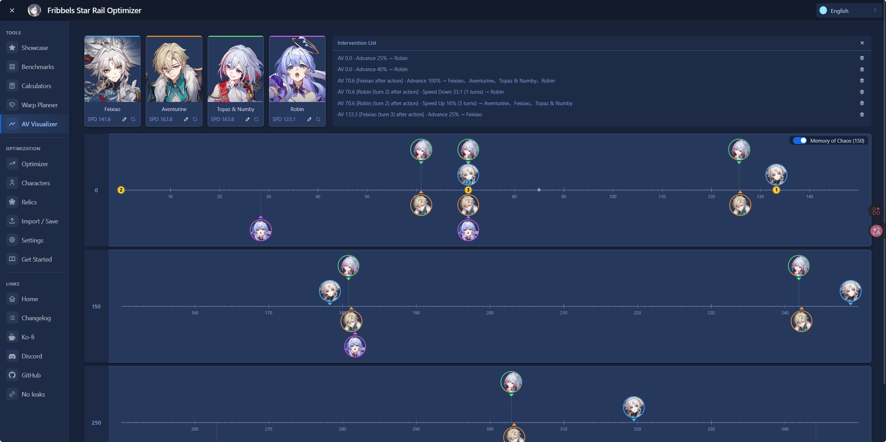
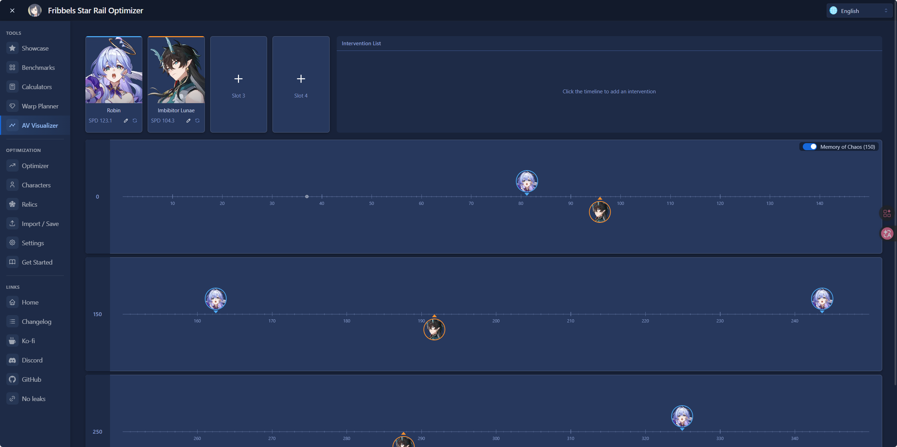
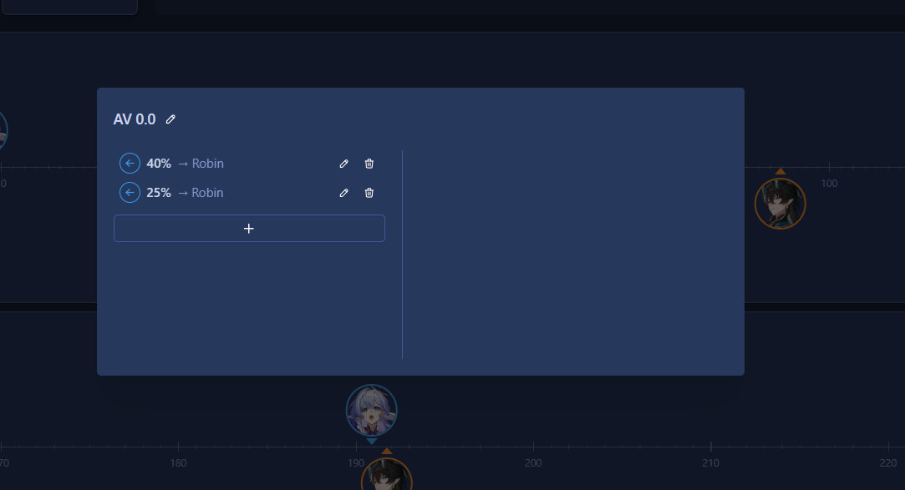
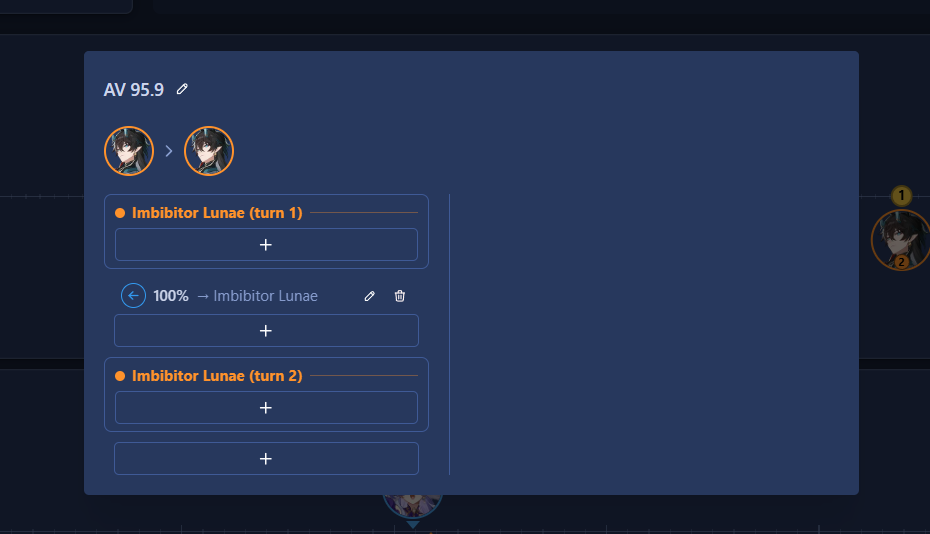

# AV Visualizer

## Overview

The AV Visualizer is a tool for visualizing the relationship between speed and Action Value (AV) in Honkai:
Star Rail, helping players plan turn order ("rotation planning" / 排轴) for up to 4 characters at once.

Currently supported:

- Converting a character's speed into its corresponding AV position on the timeline
- Manually adding speed up / speed down / advance / delay effects at a character's own action, to simulate AV
  changes caused by that character's skills or other sources
- Manually adding speed up / speed down / advance / delay effects away from any character's action, to simulate
  off-turn AV changes caused by ultimates, enemy mechanics, or other sources

Not yet supported, but planned for future updates:

- Characters casting skills, for use in damage calculation
- Automatically attaching speed up / speed down / advance / delay effects to a character's skills
- Automatically adding speed effects from Light Cones, relics, and other sources
- Energy and ultimate-timing modules

## Layout

- **Top-left — Character slots:** Four slots for selecting the characters to place on the timeline.
- **Top-right — Intervention list:** Keeps track of all interventions that have been added (an intervention is
  a single speed up / speed down / advance / delay effect placed on the timeline). This panel is also reserved
  as a general-purpose control area for future features, so its buttons may be replaced or added to over time.
- **Bottom — Timeline:** The main visualization area. Each row represents 100 AV (the first row becomes 150 AV
  instead when Memory of Chaos mode is toggled on).

## Usage

### Step 1: Import and select characters

After importing your save data, pick a character for any of the four slots. The slot automatically loads that
character's base speed stat and total speed (base speed + relic substats) — the same values shown in the
Showcase tab. The character's avatar then appears on the timeline below, placed at the AV position
corresponding to that total speed.

### Step 2: Manually add interventions

Light Cones, relics, and character kits don't yet apply their speed effects automatically (see "Not yet
supported" above), so any such effect has to be added by hand as an intervention. As an example, here's how to
simulate Robin's opening sequence — her ultimate's self-advance plus her own Trace's self-advance, both of
which pull her own action forward at the start of the fight:

1. Click the ruler at AV 0 (the start of the fight) to open the intervention list panel
2. Add a 40% **Advance** intervention targeting Robin for her ultimate's self-advance, and a separate 25%
   **Advance** intervention targeting Robin for her own self-advance
3. Done

Both interventions now show up in the intervention list on the top-right, and Robin's marker on the timeline
shifts to reflect the combined effect.

### Step 3: Multiple actions at the same AV, and self-advance after acting

Some characters advance their own action after attacking, letting them act again — possibly landing on the
exact same AV as their previous action. Here's how to simulate that, using 饮月君 as an example:

1. Click 饮月君's avatar (action marker) on the timeline to open the intervention list panel
2. In the **end-of-action** zone for that action, add a self-targeting **Advance** intervention
3. Done

饮月君 now acts again right after her first action. If the resulting AV lands on top of her previous action,
the timeline merges them into a single avatar with a count badge showing the number of actions at that AV,
instead of drawing overlapping avatars.
