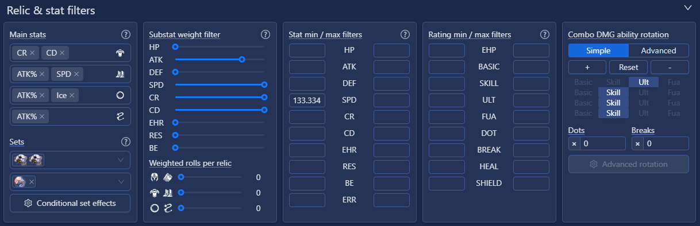
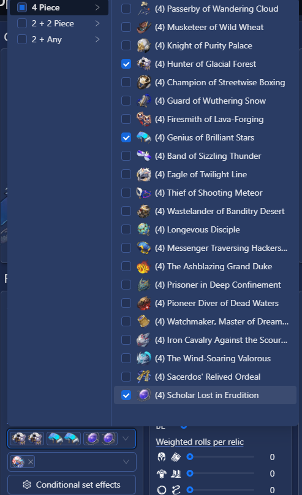
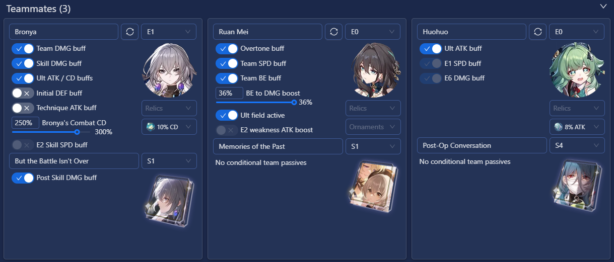
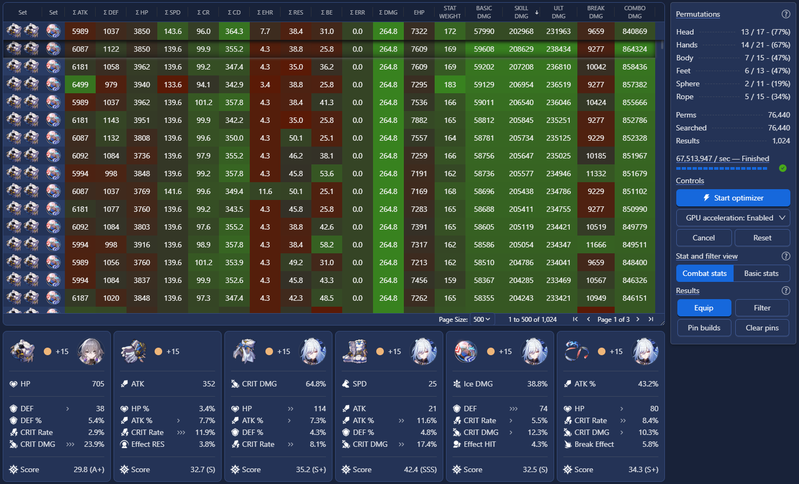

# Optimizer

## Getting started

If you would like to give the optimizer a try before doing any relic importing, use the Getting Started tab on the menu
sidebar to load a sample save file and check out the features.

## Step 1 - Import relics

The optimizer needs a database of relics to run against. Install and run one of the relic scanner options:

- (Recommended) IceDynamix Reliquary Archiver
  - Accurate speed decimals, instant scan
  - Imports full inventory and character roster
- Kel-Z HSR Scanner
  - Inaccurate speed decimals, 5-10 minutes OCR scan
  - Imports full inventory and character roster
- Relic Scorer Import
  - Accurate speed decimals, instant scan
  - No download needed, but limited to relics from the 8 characters on profile showcase
- HoyoLab Import
  - Inaccurate speed decimals, instant scan
  - No download needed, but limited to ingame characters equipped relics

## Step 2 - Select a character

Select a character and light cone from the Character Options menu. Next, use the Recommended Presets button to select a
preset speed target to optimize for. For most characters, the 133.333 speed breakpoint is recommended, and this will set
a minimum speed for your optimization results. This preset will also automatically fill out the ideal main stats and
relic set conditionals for the optimizer.

Once a character is chosen, their ability passives and light cone passives can be customized. These selectors will
affect the final combat stats and damage calculations for the character. For the first run these can be left as default.

Most of the Enemy Options and Optimizer Options can be left as default to get started. One important option is the
Character Priority filter setting, which defines which relics the character may steal from other characters. Characters
can only take relics from lower priority characters, so for the first run set this priority to #1, but later on your
characters list should be ordered by which characters have the highest priority for taking gear.

## Step 3 - Apply filters

### Main Stats

The main stat filters limits optimizer to using preferred body, feet, planar sphere, and link rope main stats. Multiple
options can be chosen for each slot. The Recommended Presets button will fill these out with each character's ideal
stats, but these can be customized for other builds.

### Set filters

The relic set filter allows for a combination of 2-piece sets, 4-piece sets, or can be left empty. When multiple options
are chosen, the search results will only show builds with least one of the selected filters active. Conditional set
effects can be customized from the menu.

### Stat min / max filters

This section defines the minimum / maximum stats to filter the results by. Left side is minimum and right side is
maximum, both inclusive. In this above example, only results with &ge; 134 speed AND &ge; 35% Crit Rate are shown. Stat
abbreviations are ATK / HP / DEF / SPD / Crit Rate / Crit Damage / Effect Hit Rate / Effect RES / Break Effect.

Important note: relics typed in manually or imported with the OCR tool may be affected by hidden decimal points for
speed that aren't shown by ingame stats. For example, 5 star relics can have speed substats of values between 2.0 - 2.6,
which would all show ingame as 2. This means that speed results should be treated as minimum values, as the real value
may be slightly higher ingame. This also means that maximum filters on speed should be used carefully since they may be
too restrictive.

## Step 4 - Select teammates

In this menu, select the 3 teammates that you're using with the main character. These teammates will apply their buffs
and passive effects to the calculations. The relic/ornament sets and conditionals can be customized to fit the combat
scenario.

## Step 5 - Start optimizer

### Result rows

This section displays all the results found that match the filters. Every row represents one build that was found. The
pinned top row shows the character's currently equipped build. Clicking on each row will show the relics used in the
selected build. There may be multiple pages of results, so clicking a column header to sort the results by a stat or
rating can make it easier to find desired builds.

### Permutations

This section shows the number of permutations the optimizer has to search and details on the number of matching relics
per slot. If any of the numbers are zero, that indicates that no relics were found that would satisfy the constraints.

- Perms - Number of permutations that need to be searched. Stricter filters will reduce permutations and search time
- Searched - Number of permutations completed in an in-progress search
- Results - Number of displayed results that satisfy the stat filters

### Selected build

This section displays the selected build from the grid, and which relics are used & who they are currently equipped on.
Pressing the 'Equip' button will assign the relics to the selected character in the optimizer, though the ingame
character build is not affected.
