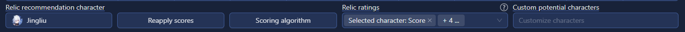

# Relics tab

## Overview

This section displays all the relics that were added / imported into the optimizer. Relics should be updated
occasionally with the importer to add in newly acquired relics. Clicking columns will sort the relics table.

## Relic recommendations

Select a character to score all relics with that character's stat weights, to find the best relics to upgrade. The stat
weights can be customized with the Scoring algorithm button.

There are multiple columns with different ratings for measuring relic quality and potential.

## Potential

Potential is a character-specific percentage of how good the relic could be (or 'is', if fully upgraded), compared
against the stats on a fully upgraded 'perfect' relic in that slot.

Potential can look at all characters or just owned. It then takes the maximum percentage for any character. This can be
useful for finding relics that aren't good on any character, or hidden gems that could be great when upgraded.

* Selected character: Score - The relic's current score as defined by the scoring algorithm for the currently selected
  character
* Selected character: Average potential - The relic's potential at its maximum level, averaged across all the possible
  rolls it could have on the way to +15
* Selected character: Max potential - The relic's maximum potential if all future rolls went into the character's
  desired stats
* All characters: Max potential - The highest possible potential value of the relic, out of all characters in the game.

## Relic locator

The relic locator helps find relics within the ingame inventory. This feature only works with the Reliquary Archiver
importer, and if new relics were deleted or obtained since the last import, they must be re-scanned and imported for
accurate results.

The 'Inventory width' setting must be set to the number of columns of your ingame inventory, which changed with screen
size. Then the 'Auto filter rows' setting will apply filters after the selected number of rows, to bring the result
closer to the top of the screen. This will then display the row / column where the relic is located, assuming that the
displayed filters are applied.
